# FastAPI_Crossfit_DIO
### API assíncrona de competição de crossfit
### O que é FastAPi?
O FastAPI é um framework web moderno, rápido e de alto desempenho para criar APIs RESTful e GraphQL com Python. Ele é baseado em type hints do Python e oferece diversas funcionalidades que facilitam o desenvolvimento de APIs robustas e escaláveis.

### O que é WorkoutAPI?

Esta é uma API de competição de crossfit chamada WorkoutAPI (isso mesmo rs, eu acabei unificando duas coisas que gosto: codar e treinar). É uma API pequena, devido a ser um projeto mais hands-on e simplificado nós desenvolveremos uma API de poucas tabelas, mas com o necessário para você aprender como utilizar o FastAPI.

## Modelagem de entidade e relacionamento - MER


## Stack da API

**A API foi desenvolvida utilizando o `fastapi` (async), junto das seguintes libs: `alembic`, `SQLAlchemy`, `pydantic`. Para salvar os dados está sendo utilizando o `postgres`, por meio do `docker`.**

OBS: Async é uma palavra usada em programação para indicar que o código é assíncrono, isso significa que o programa tem um jeito de dizer para o computador que ele terá que esperar por algo para finalizar a sua tarefa e se for necessário ele pode executar em paralelo com outras tarefas, realizando múltiplas tarefas ao mesmo tempo.

### Arquivos de configurações:

**alembic.ini = configuração do alembic (gerenciador de migrations)**

**docker-compose.yml = configuração do docker**

**settings.py = configuração do banco de dados**

OBS: migrations controle de versão do esquema do banco de dados (criar, atualizar e deletar tabelas)

### Execução da API

Para executar utilizei gerenciador de pacote pip.


```bash
pip install -r requirements.txt
```
### Para o Windows é necessário esta instalado o [Docker Desktop](https://www.docker.com/products/docker-desktop/) e o mesmo estar em execução, apos isso execute o comado abaixo:

```bash
docker-compose up -d
```

Listar os containers em execução:

```bash
docker-compose ps
```

Para criar o banco de dados, execute:

```bash
alembic upgrade head
```

## API

Para subir a API, execute:
```bash
uvicorn workout_api.main:app --reload
```
e acesse: http://127.0.0.1:8000/docs

# Desafio Final
    - adicionar query parameters nos endpoints
        - atleta
            - nome
            - cpf
    - customizar response de retorno de endpoints
        - get all
            - atleta
                - nome
                - centro_treinamento
                - categoria
    - Manipular exceção de integridade dos dados em cada módulo/tabela
        - sqlalchemy.exc.IntegrityError e devolver a seguinte mensagem: “Já existe um atleta cadastrado com o cpf: x”
        - status_code: 303
    - Adicionar paginação utilizando a lib: fastapi-pagination
        - limit e offset
# Referências

FastAPI: https://fastapi.tiangolo.com/

Pydantic: https://docs.pydantic.dev/latest/

SQLAlchemy: https://docs.sqlalchemy.org/en/20/

Alembic: https://alembic.sqlalchemy.org/en/latest/

Fastapi-pagination: https://uriyyo-fastapi-pagination.netlify.app/

### Dockes Imagem
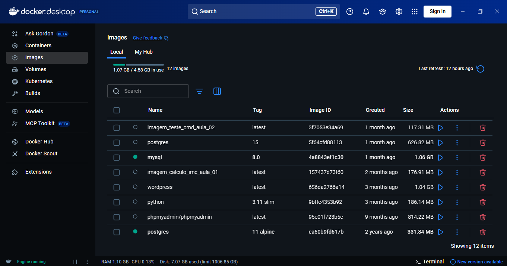

### Docker Containe
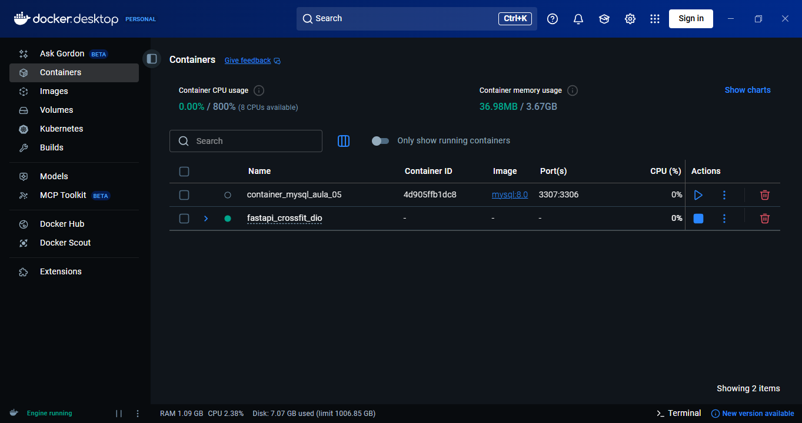

### Docker Volume
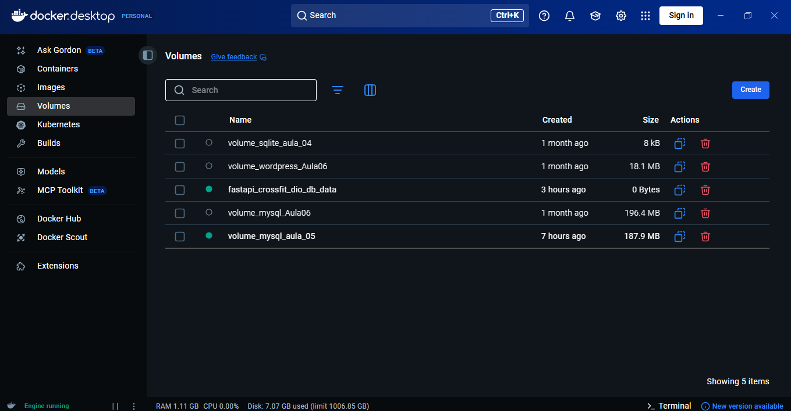

### Execução alembic


### Estrutura banco de dados
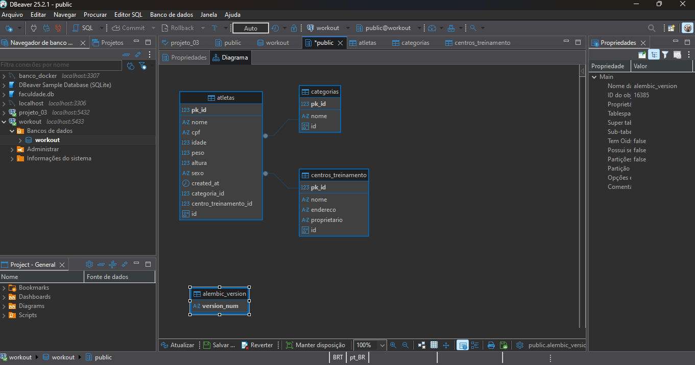

### Tabela Atletas
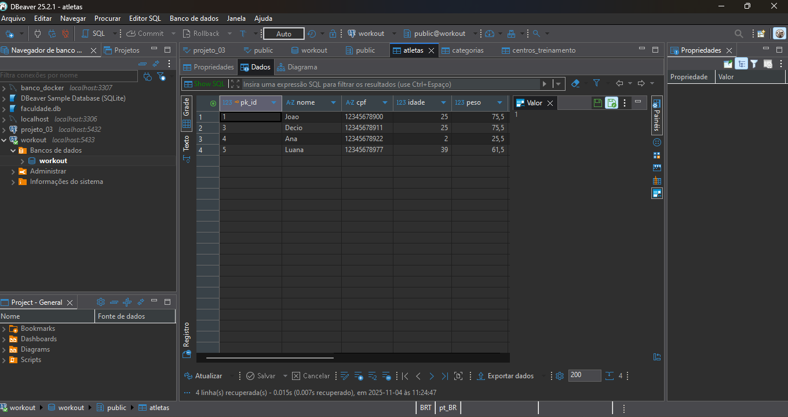

### Tabela Categorias
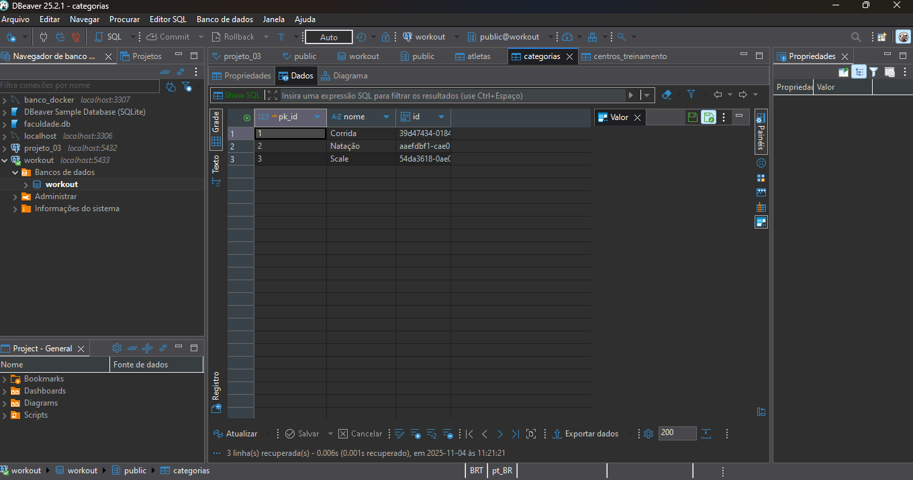

### Tabela Contros Treinamento
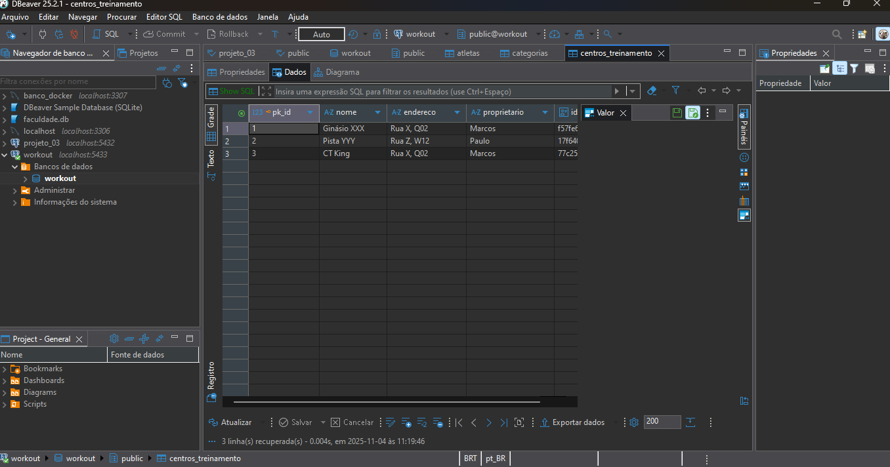

### WorkoutAPI docs paginação
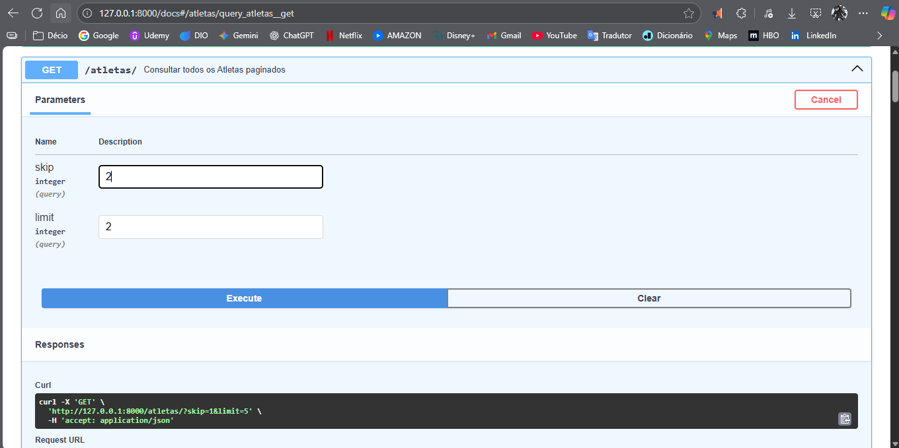
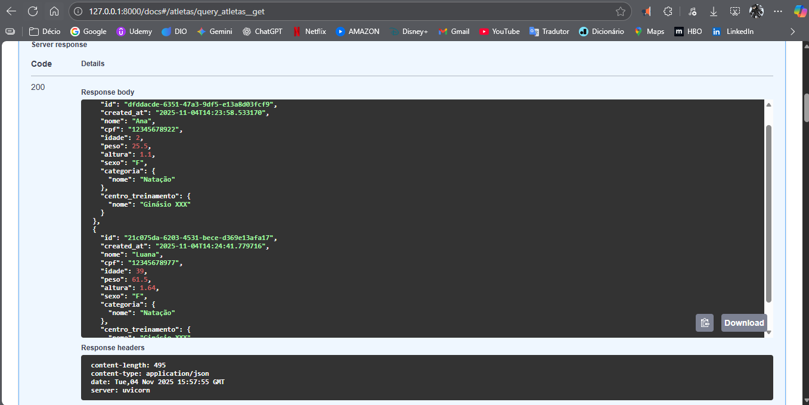

### Api workout paginação (tabela atletas)
````
from fastapi import Query

@router.get(
    '/',
    summary='Consultar todos os Atletas paginados',
    status_code=status.HTTP_200_OK,
    response_model=list[AtletaOut],
)
# Paginação
async def query(db_session: DatabaseDependency, 
                skip: int = Query(0, description="Número de registros a serem pulados (para paginação)"), 
                limit: int = Query(2, description="Número máximo de registros retornados por página")
                ) -> list[AtletaOut]:
 
    atletas_query = select(AtletaModel) #
    atletas = (await db_session.execute(atletas_query.offset(skip).limit(limit))).scalars().all()
    
    return [AtletaOut.model_validate(atleta) for atleta in atletas]
````

### WorkoutAPI docs CPF
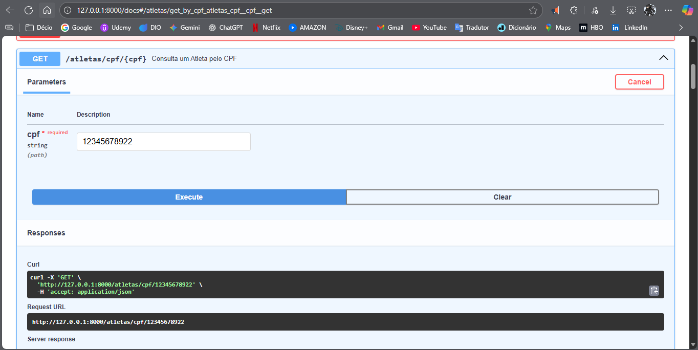
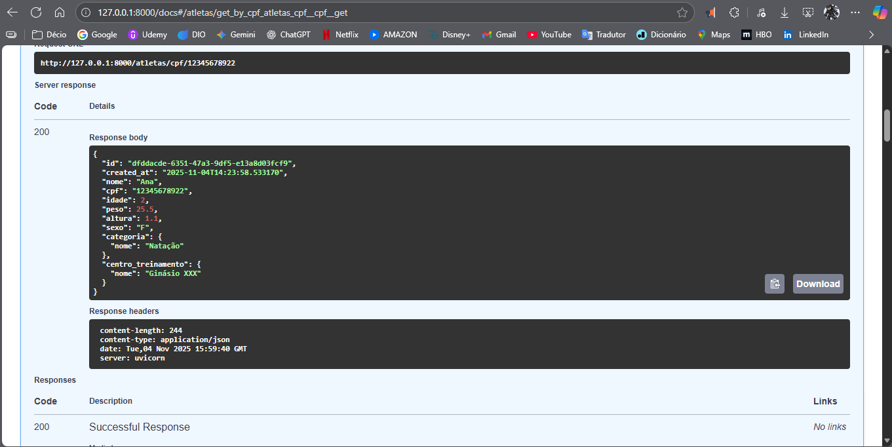

### Api workout get cpf (tabela atletas)
````
@router.get(
    '/cpf/{cpf}',
    summary='Consulta um Atleta pelo CPF',
    status_code=status.HTTP_200_OK,
    response_model=AtletaOut,
)
async def get_by_cpf(cpf: str, db_session: DatabaseDependency) -> AtletaOut:
    atleta: AtletaOut = (
        await db_session.execute(select(AtletaModel).filter_by(cpf=cpf))
    ).scalars().first()

    if not atleta:
        raise HTTPException(
            status_code=status.HTTP_404_NOT_FOUND,
            detail=f'Atleta não encontrado com o CPF: {cpf}'
        )

    return atleta
````

### WorkoutAPI docs CPF
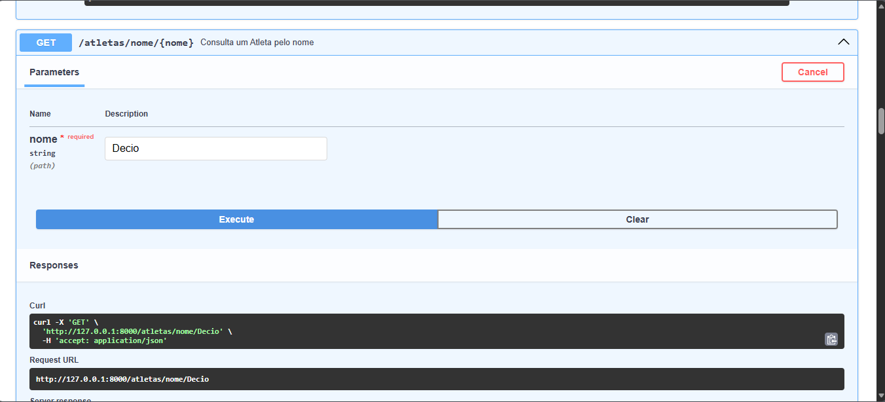
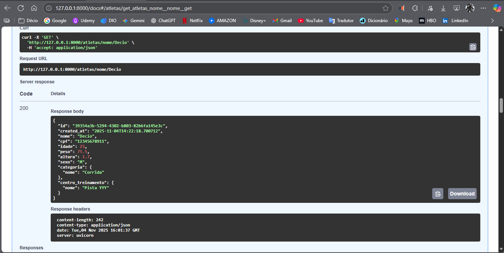

### Api workout get nome (tabela atletas)
````
@router.get(
    '/nome/{nome}', 
    summary='Consulta um Atleta pelo nome',
    status_code=status.HTTP_200_OK,
    response_model=AtletaOut,
)
async def get(nome: str, db_session: DatabaseDependency) -> AtletaOut:
    atleta: AtletaOut = (
        await db_session.execute(select(AtletaModel).filter_by(nome=nome))
    ).scalars().first()

    if not atleta:
        raise HTTPException(
            status_code=status.HTTP_404_NOT_FOUND, 
            detail=f'Atleta não encontrado no nome: {nome}'
        )
    
    return atleta
````

### WorkoutAPI docs exceção personalizado
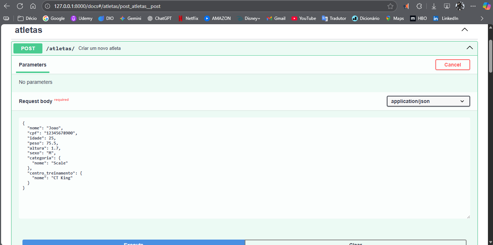
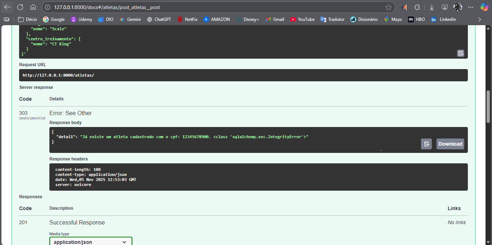


### Personalização de exceção Post (tabela atletas)

````
try:
        # código id gerado automaticamente por biblioteca uuid4 (strings de 36 caracteres alfanuméricos aleatórios) 
        atleta_out = AtletaOut(id=uuid4(), created_at=datetime.utcnow(), **atleta_in.model_dump())
        atleta_model = AtletaModel(**atleta_out.model_dump(exclude={'categoria', 'centro_treinamento'}))

        atleta_model.categoria_id = categoria.pk_id
        atleta_model.centro_treinamento_id = centro_treinamento.pk_id
        
        db_session.add(atleta_model)
        await db_session.commit()
        
    except Exception as erro:
        raise HTTPException(
            status_code=status.HTTP_303_SEE_OTHER, 
            detail= f'Já existe um atleta cadastrado com o cpf: {atleta_model.cpf}. {erro.__class__}'
        )

    return atleta_out
````